# Case study: DIY biofertilizers effects on crops

## Abstract

This report aims to evaluate the effects of using a simple "do it yourself" (DIY) biofertilizer in vegetable production and gardening.

Enabling vegetable producers and gardeners to manufacture their fertilizer input makes their operation more resilient to supply chain problems and rising prices of fertilizers.

In the experiment, we measure the performance of a biofertilizer that is easy to manufacture at home or on-farm, then we compare it to a sterilized version (control) of the same substance in the context of vegetable production and urban gardening.

Three small-scale vegetable producers conducted the trials for this case study, and soil samples, leaf samples, and crop samples were sent for laboratory analysis. On top of that, the producers measured BRIX throughout the growing season to monitor plant health.

Apart from these analyses, semi-structured interviews were conducted with the vegetable producers. Gardeners from an urban gardening company, who also trialed the biofertilizer, are included in the interview.

From the laboratory test results, we could not conclude decisive effects on plant health or crop.

The study is made possible with the funding of _Leader Södra Bohuslän_[[3][LSB]] and _Jordbruksverket_[[4][JBV]].

[LSB]:https://www.leadersodrabohuslan.se/
[JBV]:https://www.jordbruksverket.se/

## Introduction

A biofertilizer is: "... a substance which contains living micro-organisms which, when applied to seeds, plant surfaces, or soil, colonize the rhizosphere or the interior of the plant and promotes growth by increasing the supply or availability of primary nutrients to the host plant ... add nutrients through the natural processes of nitrogen fixation, solubilizing phosphorus, and stimulating plant growth through the synthesis of growth-promoting substances. The micro-organisms in biofertilizers restore the soil's natural nutrient cycle and build soil organic matter. Through the use of biofertilizers, healthy plants can be grown, while enhancing the sustainability and the health of the soil." [[1][BIOF]]

Enabling producers, farmers and gardeners to manufacture their fertilizers on-premise gives their operation higher resilience, cuts costs, and allows them to tailor the inputs to their specific needs, setting, and context.

_Gerry Gillespie_ provides the recipe for the biofertilizer evaluated in this case study and offers it freely on his website. [[2][RECIPE]]

The biofertilizer is easy to manufacture at home or on-farm, requiring only jars, a bucket with a lid, a fermentation lock, and commonly available ingredients (such as rice, milk, and yeast) from the supermarket. Optional ingredients like basalt rock powder, seaweed meal, and manure may be less accessible but are not required. The recipe steps are simple and easy to follow.

Three local vegetable producers (introduced below) conducted experiments to evaluate the effects of the biofertilizer on plant health and crop quality.

During the growing season, laboratories conducted several tests (soil analysis, leaf analysis, and crop analysis). Apart from that, the producers also measured BRIX.

"The foundational idea is that the refractive index (BRIX) of plant sap correlates to the content of dissolved solids, including sugars, and can be used as an overall assessment of plant health." [[3][JKEMPF]]

Measuring BRIX is easy with a refractometer and can be done in the field; a test takes seconds or minutes to complete. The higher the reading, the better plant performance and health. Unfortunately, it only hints at plant health, and one can not make conclusions (like specific nutrient deficiencies) based on its reading.

A common problem when conducting case studies is environmental factors (like water, deficiencies/excess nutrients) that play in. Therefore, the trial compares two beds (experiment and control) in close vicinity with similar conditions.

When gardening, one tries to manipulate a system so complicated that it is almost impossible to foresee a particular action's consequences. Parts of the system one can control to some extent, like water availability. Other parts of the system are harder to manipulate and understand how they relate, like temperature, sun exposure, bugs, pests, and soil microbiome, to name a few. Consequently, gardeners resort to gut feeling when making decisions based on previous experience, intuition, convictions, etc.

The gut feelings of the producers and gardeners are relevant to this case study since not _everything_ is measurable, nor is _everything_ sent to a lab for analysis in this case study. Therefore, interviews were conducted with the producers and gardeners to capture these intangible dimensions of gardening.

[BIOF]: https://en.wikipedia.org/wiki/Biofertilizer
[JKEMPF]: https://johnkempf.com/the-challenges-of-managing-nutrition-with-brix-readings/
[RECIPE]: https://www.gerrygillespie.net/uploads/4/5/6/5/45656863/bioferments_biostimulants_and_biofertilisers_-_making_them_on-farm_fact_sheet_final_metric_march_2019.pdf

### The vegetable producers

The producers in this experiment are all small-scale vegetable producer that grows ecological food on their land. They use sustainable farming practices and do not rely on heavy machinery or equipment. Instead, they rely on hand tools and natural fertilizers to grow a diverse range of vegetables on their 300-1050 square meters. These producers sell most of their ecologically-grown food directly to customers and local businesses or farm stands.

They manage their lands with ideas from _conservation agriculture_[[4][CA]], such as minimizing soil disturbance and maintaining permanent soil cover.

The producers operate on the west coast of Sweden, in Kungälv, Stenungssund, and Ljungskile (20-60 km north of Gothenburg).

The case study was performed in their market gardens.

[CA]: https://en.wikipedia.org/wiki/Conservation_agriculture

#### Timmervikens skafferi

_Timmervikens skafferi_ operates approximately 800 square meters of beds and passages, as well as 250 square meters of greenhouses. The main fertilizer inputs used for growing are horse manure and lucern pellets, and the farm has recently increased its use of cover crops with plans to continue doing so in the future. To control caterpillars of the "large white" (_Pieris brassicae_), inputs with _Bacillus Thurengensis_ inoculants are used[[5][BT]]. Ferric Phosphate pellets are used to control slugs (_Arion vulgaris_)[[6][SLUG]].

The farm practices no-till/no-dig management methods[[7][NOTILL]] and actively promotes the soil microbiology.

[BT]: https://en.wikipedia.org/wiki/Bacillus_thuringiensis
[SLUG]: https://en.wikipedia.org/wiki/Spanish_slug
[NOTILL]: https://en.wikipedia.org/wiki/No-till_farming

#### Branseröds gård

_Branseröds gård_ operates on fifthteen 10 square meters of beds, as well as an additional 100 square meters for growing crops like potatoes and corn. On top of that, _Branseröds gård_ have 168 square meters of greenhouse beds.

Fertilizer inputs are sourced on-farm from cows, sheep, and goats, specifically using cow deep bedding in their greenhouse beds.

To control caterpillars of the "large white", they use _Bacillus Thurengensis_ inoculants once a year.

Management methods originates in no-till/no-dig

Instead of tilling or cultivating the beds, they use a broad fork to aerate the beds before the growing season and cover the beds with plastic during the winter.

The tests were conducted in the greenhouse, which had relatively poor tomato conditions. The growing medium is semi-decomposed animal bedding (cow).

Remark: the experiment bed had possibly a bit better conditions that the test bed.

### Vävra köksträdgård

_Vävra köksträdgård_ operates on seven 20m x 0,7m beds and two greenhouses 90 square meters, 65 square meters respectively.

The primary fertilizer input is lucern pellets. In addition, ferric phosphate pellets are used to control slugs (_Arion vulgaris_) and inoculants with  _Bacillus Thurengensis_ to control caterpillars of the "large white."

Like the other producers, _Vävra köksträdgårds_'s management methods originate in no-till/no-dig and, among other things, avoid excess cultivation of the beds. Once a year, all beds are aerated using a broad fork. Has started to use cover crops and wish to do more of that going forward.

The tests were conducted in one of the greenhouses.

### Gardeners from Bee Urban

Bee Urban[[8][BU]] is a company based in Stockholm, Sweden that specializes in the design, construction, and maintenance of urban gardens that provide habitats for insects, animals, and birds, while also providing recreational areas for humans. They typically create meadow-like environments, often on rooftops, using specific species of flowers that are beneficial for bumble bees, solitary bees, and other insects.

Their clients are typically larger businesses and municipalities. As of the time of this report, they have ten gardens in the Stockholm area and have tested the biofertilizer on one of them.
TODO!!! Kolla siffrorna.
[BU]: https://beeurban.se/

## Method

### Experiment setup

The three vegetable producers set up two tomato green house beds with similar conditions, including sun exposure, soil type, and water availability. Both beds were planted with the same varieties of tomatoes.

Each producer received two jars, one containing the biofertilizer and the other serving as the control substance. The jars were labeled to keep them separate, and instructions on how to prepare, apply, and measure BRIX were also provided.

The substances were diluted at a ratio of 1:150 before application, which was done using a handheld low-pressure sprayer as a foliar spray. Applications were conducted either early in the morning or late in the evening, as per the instructions. The producers randomly assigned one jar to one bed and the other jar to the other bed.

The first application of biofertilizer was made to the roots of the tomatoes before planting. Approximately every second week throughout the growing season, additional applications were made.

### Prepation of substances

Instructions for preparing the biofertilizer used in the experiment are available in [[2][RECIPE]]. In our experiment, we used a version without any manure, as requested by the producers. Instead, we used LAB Serum, which the recipe indicates is a suitable replacement. Instructions for making LAB serum are also available in [[2][RECIPE]].

The biofertilizer used in this experiment included seaweed meal (marked as optional in the recipe) and excluded rock phosphate powder (also marked as optional).

The control substance was a sterilized version of the biofertilizer (boiled for two minutes).

The two substances were then placed into sterilized jars, which were marked with a code. The meaning of the code was recorded, but not disclosed to the producers.

### Tests

Throughout the case study, samples were taken from the experiment and control bed and sent to laboratory for analysis (expect for the _spring soil sample_ were only one sample was taken).

The samples were taken at the same time and packed and deliviered as prescibed by the laboratory.

Overall, the following tests were performed:

- Soil analysis in early spring (before the growing season started),
- Leaf for analysis (samples were sent when fruit started ripening)
- Tomato analysis for measuring lycopene levels and vitamin C (considered to be quality indicators of tomatoes)
- Soil analysis in late autumn (after the growing season ended)

On top of that BRIX was measured and recorded before and after every application of the substances with a few hours apart.

The reports from the analyses can be found in the appendix of this report.

Each test is explained in more detail below.

#### Soil analysis

To understand the effects of the inputs on soil quality, each producer conducted a soil test in the early season (May) and two additional tests in the control and experimental beds during the late season (December). The spring test reports provide a baseline measurement of the chemical composition of the soil before any inputs were applied, while the late season tests reveal the potential impacts of the inputs on the soil's chemical composition over the course of the growing season.

The Spurway method was used for the soil tests, which provide information on the availability of nutrients in the soil. The laboratory results were categorized as "low", "pretty low", "good", "pretty high", or "high".

The spring sample was collected from only one of the beds. The autumn samples was collected from both experiment and control beds.

#### Leaf analysis

Leaf analysis is a method of evaluating the nutrient content of plant leaves. Leaf analysis helps identifying nutrient deficiencies that may not be apparent through other methods, such as soil testing, and can help guide the application of fertilizers or other nutrients to ensure that plants are receiving adequate nutrition.

The method can also be used to monitor the effectiveness of fertilization programs and to identify potential problems with plant nutrition that may be impacting crop yields.

The leaf samples were collected when the tomatoes started to ripen.

#### Tomato analysis

Lycopene and vitamin C are important nutrients found in tomatoes and are often used as indicators of tomato quality.

Lycopene is a pigment that gives tomatoes their red color and is a powerful antioxidant. It has been linked to several health benefits, including reducing the risk of certain types of cancer[[9][MEDSCPC]] and heart disease[[10][NIHGOV1]], and may also have anti-aging and skin-protecting effects.

Vitamin C is an essential nutrient to maintain a healthy immune system and is also an antioxidant. In addition, it plays a role in the synthesis of collagen, which helps to keep skin and connective tissue strong, and may also help to reduce the risk of certain types of cancer[[11][NIHGOV2]] and heart disease[[12][NIHGOV3]].

In general, tomatoes higher in lycopene and vitamin C are considered to be of higher quality, as they may provide a greater range of health benefits to consumers.

In hindsight, testing for lycopene is not an ideal measurement for comparing tomatoes [[13][LVTOM]], since it closely relates on the ripeness of the tomato. However, since the tomatoes were harvested by the producers at the same time, and considered to have reached a similar level of ripeness, the results are still interesting in this study.

[NIHGOV1]: https://www.ncbi.nlm.nih.gov/pmc/articles/PMC8880080/
[NIHGOV2]: https://www.ncbi.nlm.nih.gov/pmc/articles/PMC8750500/
[NIHGOV3]: https://www.ncbi.nlm.nih.gov/pmc/articles/PMC5000725/
[MEDSCPC]: https://www.medscape.com/viewarticle/487510?reg=1
[LVTOM]: https://www.livsmedelsverket.se/globalassets/publikationsdatabas/rapporter/2008/rapp-15_naringsforandringar_080825_klar.pdf

#### BRIX analysis

Measuring BRIX, or degrees Brix (°Bx), of the plant's sap, indicates the plant's health and performance.

Plant sap with high sugar levels means that the plant is receiving sufficient nutrients and light, while low levels may suggest that the plant is experiencing stress or not getting enough nutrients.

A small sample of plant sap was extracted (with a garlic press) from the plant leaves and then measured with a digital refractometer.  

The case study measured BRIX before and a couple of hours after applying the biofertilizer.

Measurements started after the plants had reached the size where removing leaves would no longer negatively affect the plant's development.

### Interviews with the producers and gardeners

Semi-structured interviews with the three vegetable producers and Bee Urban were done to capture the hard-to-measure aspects of their experiences using the biofertilizer. It serves as a good complement to the findings of the lab analyses.

## Result

The case study was unable to differentiate between the control and experimental beds in terms of the selected indicators in the study.

The lack of correlation between inputs and the resulting lab analysis is not uncommon. Many factors, like deficiencies in water or nutrients, and environmental factors, such as temperature and sunlight, might affect the plant more than the input.

Despite the lack of correlation, diagrams are provided in the following sections to visualize the differences between the control and experimental beds.

The reports from laboratories are included in the appendix.

### Results: Soil analysis

Diagrams are included below to visually compare the spring, control, and experimental test results.

#### Soil tests for Timmervikens skafferi

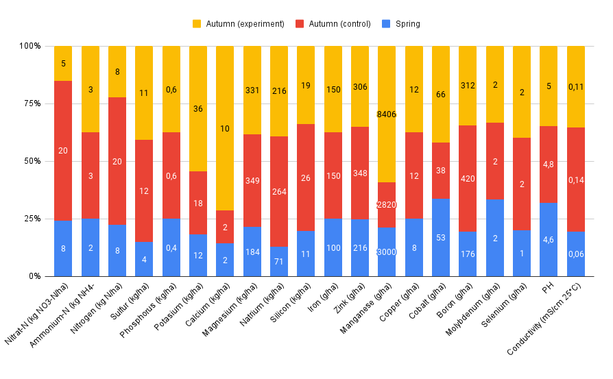

| Element | Spring | Experiment | Control |
|------------------------|---------------|---------------|---------------|
| Nitrogen (kg N/ha) | Low | Low | Low |
| Sulfur (kg/ha) | Low | Low | Low |
| Phosphorus (kg/ha) | Low | Low | Low |
| Potasium (kg/ha) | Low | Low | Low |
| Calcium (kg/ha) | Low | Low | Low |
| Magnesium (kg/ha) | Pretty High | Pretty High | Pretty High |
| Natrium (kg/ha) | Good | High | High |
| Silicon (kg/ha) | High | High | High |
| Iron (g/ha) | Low | Low | Low |
| Zink (g/ha) | Good | Good | Good |
| Manganese (g/ha) | High | High | High |
| Copper (g/ha) | Low | Low | Low |
| Cobalt (g/ha) | High | High | High |
| Boron (g/ha) | Pretty High | Pretty High | Pretty High |
| Molybdenum (g/ha) | Low | Low | Low |
| Selenium (g/ha) | Low | Low | Low |

#### Soil tests for Vävra Köksträdgård

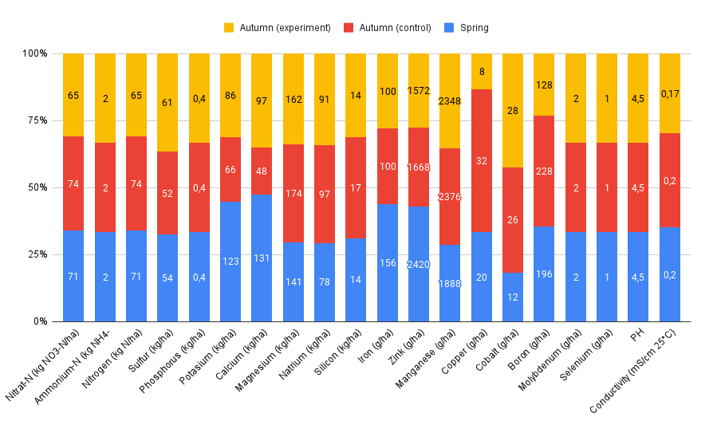

| Element | Spring | Experiment | Control |
|------------------------|---------------|---------------|---------------|
| Nitrogen (kg N/ha) | Pretty High | Good | Pretty High |
| Sulfur (kg/ha) | Good | Good | Good |
| Phosphorus (kg/ha) | Low | Low | Low |
| Potasium (kg/ha) | Good | Pretty Low | Pretty Low |
| Calcium (kg/ha) | Pretty Low | Pretty Low | Pretty Low |
| Magnesium (kg/ha) | Good | Good | Pretty High |
| Natrium (kg/ha) | Good | Good | Good |
| Silicon (kg/ha) | High | High | High |
| Iron (g/ha) | Pretty Low | Low | Low |
| Zink (g/ha) | High | Pretty High | Pretty High |
| Manganese (g/ha) | High | High | High |
| Copper (g/ha) | Pretty Low | Low | Good |
| Cobalt (g/ha) | High | High | High |
| Boron (g/ha) | Pretty High | Good | Pretty High |
| Molybdenum (g/ha) | Low | Low | Low |
| Selenium (g/ha) | Low | Low | Low |

#### Soil tests for _Branseröd Gård_

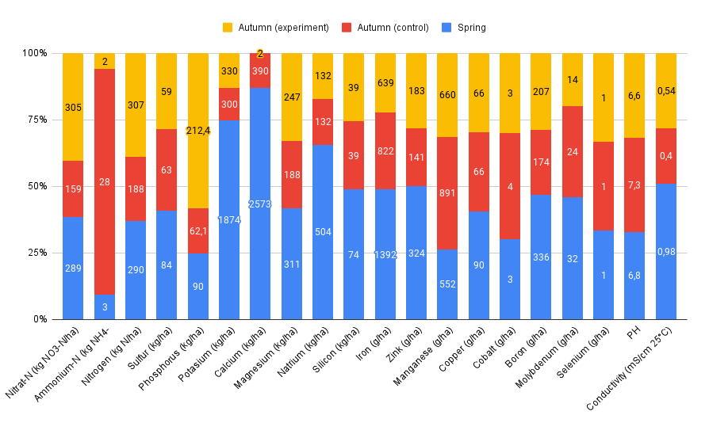

| Element | Spring | Experiment | Control |
|------------------------|---------------|---------------|---------------|
| Nitrogen (kg N/ha) | High | High | High |
| Sulfur (kg/ha) | Good | Pretty High | Pretty High |
| Phosphorus (kg/ha) | High | High | High |
| Potasium (kg/ha) | High | High | High |
| Calcium (kg/ha) | High | Low | Pretty High |
| Magnesium (kg/ha) | Pretty High | High | High |
| Natrium (kg/ha) | Pretty High | Pretty High | Pretty High |
| Silicon (kg/ha) | High | High | High |
| Iron (g/ha) | High | High | High |
| Zink (g/ha) | Good | Good | Good |
| Manganese (g/ha) | Good | High | High |
| Copper (g/ha) | Pretty High | High | High |
| Cobalt (g/ha) | Good | Pretty High | Pretty High |
| Boron (g/ha) | Pretty High | Pretty High | Pretty High |
| Molybdenum (g/ha) | High | High | High |
| Selenium (g/ha) | Pretty Low | Low | Low |

#### Comments on Soil tests

The soil tests do not indicate that the biofertilizer has affected the soil in this case study. The experiment and control beds are scored very similarly across all tomato producers.

#### Result: Leaf analysis

Due to miscommunication, _Timmervikens skafferi_ and _Branseröds gård_ used the same test, while _Vävra Köksträdgård_ used a different one.

Despite these differences, the results were still similar enough to be considered relevant for this case study.

The results of the leaf analysis for _Timmervikens skafferi_ and _Branseröds gård_ were categorized as "low," "pretty low," "good," "pretty high," or "high." For Timmervikens skafferi and Branseröd Gård, only the categories of "low," "good," and "high" were applicable.

#### Leaf analysis for _Timmervikens skafferi_

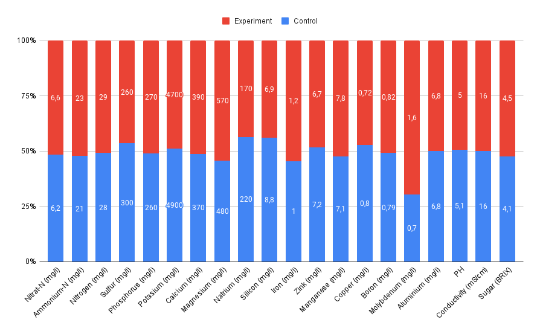
|               | Experiment | Control |
| ------------- | ---------- | ------- |
| Nitrogen (mg/l) | Low | Low |
| Sulfur (mg/l) | Good | Good |
| Phosphorus (mg/l) | Low | Low |
| Potasium (mg/l) | Good | Good |
| Calcium (mg/l) | Low | Low |
| Magnesium (mg/l) | Good | Good |
| Natrium (mg/l) | High | High |
| Silicon (mg/l) | Low | Low |
| Iron (mg/l) | High | High |
| Zink (mg/l) | High | High |
| Manganese (mg/l) | Good | Low |
| Copper (mg/l) | High | High |
| Boron (mg/l) | High | High |
| Molybdenum (mg/l) | High | High |
| Aluminium (mg/l) | Good | Good |
| PH | Good | Good |
| Conductivity (mS/cm) | Good | Good |
| Sugar (BRIX) | Good | Good |

#### Leaf analysis for _Vävra Köksträdgård_

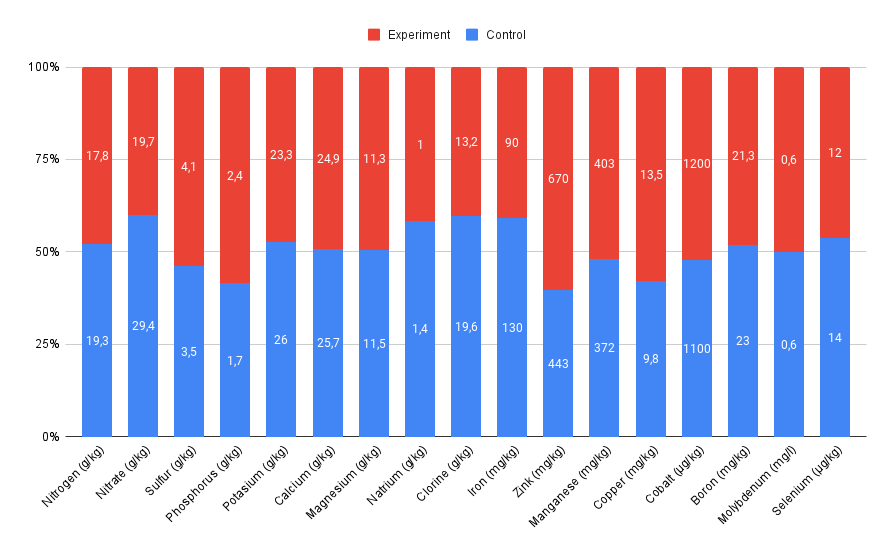

|               | Experiment | Control |
| ------------- | ---------- | ------- |
| Nitrogen (g/kg) | Low | Low |
| Sulfur (g/kg) | Low | Low |
| Phosphorus (g/kg) | Pretty low | Pretty low |
| Potasium (g/kg) | Pretty low | Pretty low |
| Calcium (g/kg) | Good | Good |
| Magnesium (g/kg) | High | High |
| Iron (mg/kg) | Good | Good |
| Zink (mg/kg) | High | High |
| Manganese (mg/kg) | High | High |
| Copper (mg/kg) | Pretty high | Good |
| Cobalt (μg/kg) | Pretty high | Good |
| Boron (mg/kg) | Pretty low | Pretty low |
| Molybdenum (mg/l) | Pretty low | Pretty low |
| Selenium (μg/kg) | Good | High |

#### Leaf analysis for _Branseröd Gård_

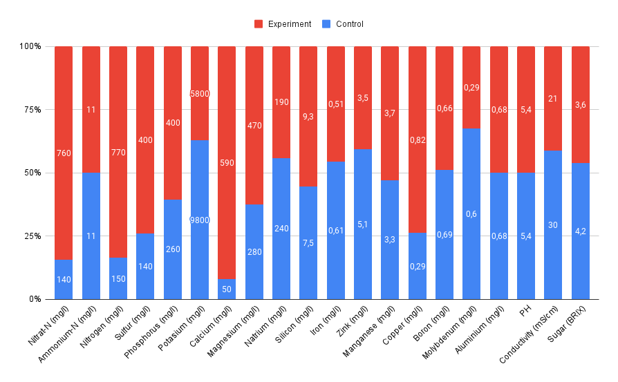

|               | Experiment | Control |
| ------------- | ---------- | ------- |
| Nitrogen (mg/l) | Low | Low |
| Sulfur (mg/l) | Good | Low |
| Phosphorus (mg/l) | Good | Low |
| Potasium (mg/l) | Good | High |
| Calcium (mg/l) | Low | Low |
| Magnesium (mg/l) | Good | Low |
| Natrium (mg/l) | High | High |
| Silicon (mg/l) | Low | Low |
| Iron (mg/l) | Low | Low |
| Zink (mg/l) | Good | High |
| Manganese (mg/l) | Low | Low |
| Copper (mg/l) | High | Low |
| Boron (mg/l) | Good | Good |
| Molybdenum (mg/l) | Good | High |
| Aluminium (mg/l) | Good | Good |
| PH | Good | Good |
| Conductivity (mS/cm) | Good | High |
| Sugar (BRIX) | Good | Good |

#### Comments on Leaf analysis

While some differences between the control and experiment beds were observed in the data, it is difficult to draw any definitive conclusions about the impact of the biofertilizer.

At _Branseröds gård_, the experiment bed had significantly more values classified as "good" than the control bed. However, this pattern is not consistently observed across all producers or beds.

#### Fruit analysis

It should be stressed that one can not compare the results between the producers as these values are, among other things, dependent on variety and ripeness.

#### Tomato tests for _Timmervikens skafferi_

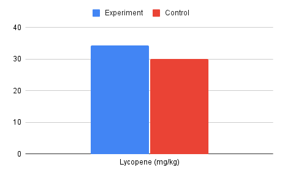 

#### Tomato tests for _Vävra Köksträdgård_

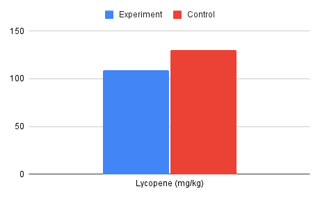 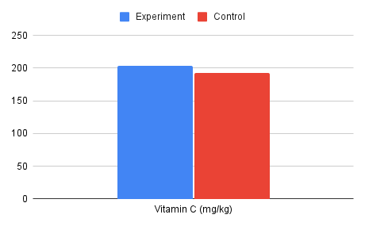

#### Tomato tests for _Branseröd Gård_

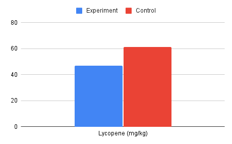 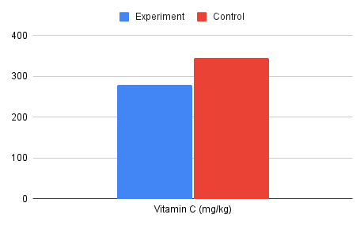

#### Comments on Tomato tests

The results for lycopene and vitamin C levels among the producers were mixed.

For _Timmervikens skafferi_, the experiment bed had higher levels of both nutrients, while for _Branseröd Gård_, the experiment bed had lower levels for both nutrients. For _Vävra köksträdgård_ it showed the another pattern, with higher levels of vitamin C in the experiment bed but lower levels of lycopene.

Overall, the data does not support any clear conclusions about the potential effects of the biofertilizer.

Worth noting is a the levels of vitamin C in these tomatoes are 30%-230% higher compared to the "standard tomato" from _Livsmedelsverket's Livsmedelsdatabasen_ (National Food Administration, Sweden - Food database) [[14][LVLD]].

[LVLD]: https://www.livsmedelsverket.se/livsmedelsdatabasen

#### Results: BRIX analysis

The producers found it challenging to get consistent readings, as two samples from the same plant could produce different results. As a result, the plant sap was strained through cloth before the measurements was recorded.

#### BRIX readings for _Timmervikens skafferi_

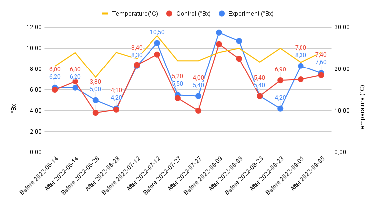

#### BRIX readings for _Vävra Köksträdgård_

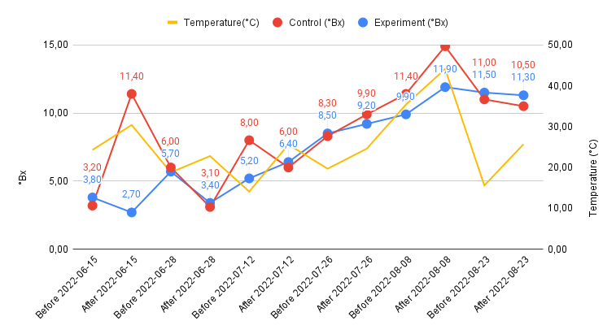

#### BRIX readings for _Branseröd Gård_

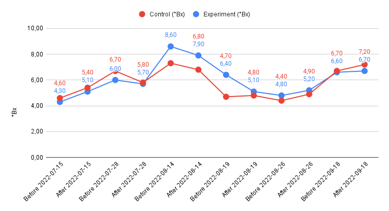

#### Comments on BRIX readings

The problem of getting consistent BRIX readings, raises concerns about the reliability of these measurements presented. If a similar study is to be done in the future, one needs to find ways to increase the reliability of BRIX readings.

These result provide no strong evidence to suggest that the biofertilizer had a significant impact on the plants in this study.

### Summary of tests and analysis

Despite analyzing various aspects of soil and plant health, this study was unable to draw any conclusions about the impact of using this biofertilizer on the health of the producers' tomato plants and tomatoes.

As mentioned earlier, this may be due to the complex and varied environmental factors that can influence plant health.

Another related reason for not being able to measure effects of the bio-stimulating properties of the experiment substance, could be that the producers already have a microbiologically rich soil. All of them use methodoliges that both protects and promotes the microbiology.

## Interviews

The following sections summarize the responses from the (semi-structured) interviews relevant to this study.

Each interview, along with its questions and answers (summarized), is available in the appendix.

### The Biofertilizer

None of the substances (experiment and control) did not do any harm to the crops, quite the opposite. _Branseröd gård_ estimated that the experiment bed had a 300% larger yield than the control. _Timmervikens skafferi_ had ~9% higher yield in the experiment bed. (_Bee Urban_ and _Vävra köksträdgård_ did not measure/take note of yield differences).

_Bee Urban_ observed that the biofertilizer seems to perform at least as well as worm compost[[15][VERM]] and bokashi[[16][BOKASHI]].

_Branseröd gård_'s control bed had problems with blossom-end rot[[17][BER]] which the experiment bed did not. The other tomato producers did not see any difference concerning pests and diseases.

The producers found it easy to mix and apply the biofertilizer in their beds.

A note on _Branseröd gård_: As mentioned earlier, the tests were conducted in relatively poor tomato conditions. The growing medium is semi-decomposed animal bedding (cow), which could be an explanation of the remarkable results.

A note on _Timmervikens gård_: It was mentioned in the interview that the experiment bed had slightly more sun exposure, which could explain the difference in yield.

[VERM]: https://en.wikipedia.org/wiki/Vermicompost
[BOKASHI]: https://en.wikipedia.org/wiki/Bokashi_(horticulture)
[BER]: https://en.wikipedia.org/wiki/Calcium_deficiency_(plant_disorder)

### Measuring BRIX

All of the tomato produers had problems getting consistent readings of BRIX. Measurements performed on samples from same plant, only seconds apart, could yield significatly different readings.

As a consequence of this it was impossible for them to conclude any difference between the control and experiment beds.

All of the tomato producers will continue measuring BRIX and hope to find a more consistent way of getting results.

These tests was not performed by _Bee Urban_

### Soil tests

All of the tomato producers had done soil tests previously and nothings in the results surprised them.

These tests was not performed by _Bee Urban_

### Leaf tests

The results of the leaf tests showed very little difference between control and experiment bed. On top of that their results are hard to interpret for the producers.

These tests was not performed by _Bee Urban_

### Crop tests

These tests was especially interesting to the tomato producers, it was mentioned that the results could be used as selling-point for their tomatoes.

These tests was not performed by _Bee Urban_

## Conclusion and discussion
